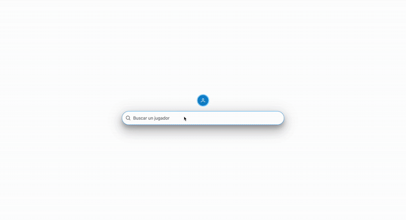

# Sport leagues CRUD

Small CRUD application to manage sport leagues, teams and players. It was written with Angular and PrimeNG. The data the app feeds from, will be provided by a simulated API you need to run locally with the help of `json-server`

This project was generated with [Angular CLI](https://github.com/angular/angular-cli) version 12.2.0.

## Development servers

- **Fake api:** Install fake api server by a one time execution of `npm install -g json-server`, and then, run `json-server --watch fake-database.json` every time you need to enable your fake api. The fake api will be exposed at `localhost:3000`. This server is powered by [json-server at NPM](https://www.npmjs.com/package/json-server), for more info on how it works, please check the link before.

- **Source code:** Run `ng serve` for a dev server. Navigate to `http://localhost:4200/`. The app will automatically reload if you change any of the source files.

## Build

Run `ng build` to build the project. The build artifacts will be stored in the `dist/` directory.
